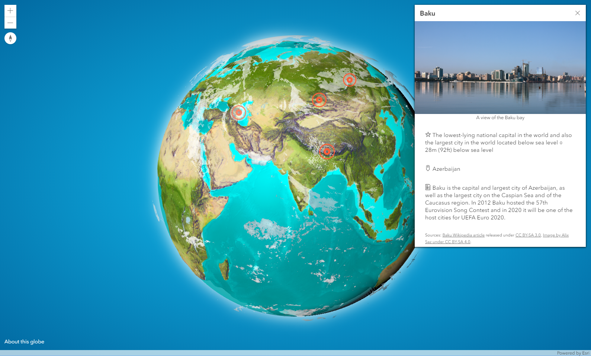

# The globe of extremes

3D Globe created by [John](https://www.esri.com/arcgis-blog/author/j_nelson/) and [Raluca](https://www.esri.com/arcgis-blog/author/raluca_zurich/) after getting inspired by [this awesome globe](https://www.fonterra.com/nz/en/campaign/from-here-to-everywhere.html#/home) and [this awesome globe](https://www.instagram.com/p/Bt8zyI-gsqW/). We used [ArcGIS API for JavaScript](https://developers.arcgis.com/javascript/) to create the interactive globe and [ArcGIS Pro](https://pro.arcgis.com/) to create the basemap. We used this [Wikipedia article](https://en.wikipedia.org/wiki/Extreme_points_of_Earth) to get a list of extreme points on Earth, this [3D sphere model](https://sketchfab.com/3d-models/sphere-b31b12ffa93a40f48c9d991b6f168f4d) by 3D Various under CC BY 4.0 for the ocean surface and this [cloud image](https://visibleearth.nasa.gov/view.php?id=57747) from NASA Goddard Space Flight Center (image by Reto Stöckli) for the cloud layer.

We wrote about how we created this globe in this [blog post]().

[View it live](https://ralucanicola.github.io/the-globe-of-extremes/)
